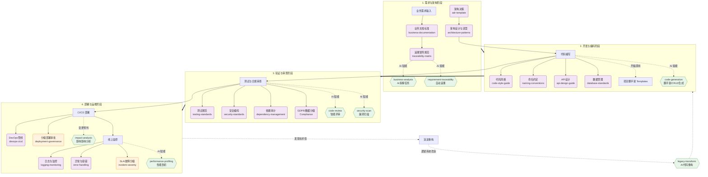

# SDD - Software Development Discipline
### 企业级 AI 编程范式解决方案

> 覆盖软件全生命周期的工程化治理框架，通过 AI 智能代理赋能团队实现编码质量、安全合规和工程效率的全面提升。
> 支持跨行业定制（金融/医疗/电商/政务），从小团队到百人规模渐进式采纳。

---

## 📋 框架总览与全生命周期链路

本框架包含 **7 大模块**，共计 **68 个文件**，覆盖从需求分析到生产运维的完整生命周期。

### 🔄 全生命周期使用图谱



### 🗂 目录结构明细

| 模块 | 目录 | 文件数 | 职责 |
|------|------|:------:|------|
| 📐 工程规范 | [`standards/`](./standards/) | 19 | 编码风格、架构、安全、测试、数据库、业务文档等全维度标准 |
| 🤖 AI 技能库 | [`.agents/skills/`](./.agents/skills/) | 12 | 代码生成/重构/优化/安全检测 + 业务分析/影响预判 |
| ⚙️ 智能工作流 | [`.agents/workflows/`](./.agents/workflows/) | 14 | 自动化代码评审、工程审计、需求追溯、发布管理等 |
| 🏗️ 项目模板 | [`templates/`](./templates/) | 3 类 | 微服务/前端/公共库开箱即用的项目骨架 |
| 🔒 合规框架 | [`compliance/`](./compliance/) | 3 | GDPR/个保法清单、数据分级、审计追踪 |
| 🏛️ 工程治理 | [`governance/`](./governance/) | 7 | 技术雷达、ADR、RACI、故障分级、SLA、变更管理、部署治理 |
| 📚 实施指南 | [`guides/`](./guides/) | 8 | 快速上手、团队导入、培训、定制、成熟度模型、ROI、业务文档实施 |

共计 **68 个文件**，覆盖从需求分析到生产运维的完整生命周期。

---

## 🚀 快速开始

### 1. 最小起步集
如果你的团队刚接触 SDD，从这里开始：
```
阅读：standards/code-style-guide.md
阅读：standards/naming-conventions.md
阅读：standards/git-workflow.md
执行：/standards-check  ← 让 AI 检查你的代码
```

### 2. 进阶采纳
```
阅读：standards/architecture-patterns.md
阅读：standards/security-standards.md
阅读：standards/testing-standards.md
执行：/code-review  ← 让 AI 做全面的代码评审
```

### 3. 业务文档标准化（当前重点）
```
阅读：standards/business-documentation.md    ← 业务文档编写标准
阅读：standards/traceability-matrix.md       ← 需求-代码追溯规范
阅读：guides/business-doc-implementation.md  ← 分步实施手册
执行：/business-audit                        ← 业务文档审计
执行：/requirement-traceability              ← 需求追溯扫描
```

### 4. 全面落地
```
阅读：guides/team-adoption.md     ← 团队导入策略
阅读：guides/maturity-model.md    ← 评估当前水平
执行：/project-health             ← 项目健康度检查
执行：/engineering-audit           ← 工程化审计
```

详细入门指南请查看 [`guides/quick-start.md`](./guides/quick-start.md)。

---

## 🤖 可用的 AI 斜杠命令

### 核心工程流程
| 命令 | 功能 |
|------|------|
| `/standards-check` | 代码规范一致性检查 |
| `/code-review` | 智能代码评审 |
| `/security-scan` | 安全漏洞扫描 |
| `/project-health` | 项目健康度评估 |
| `/engineering-audit` | 全面工程审计 |

### 业务与需求追溯
| 命令 | 功能 |
|------|------|
| `/business-audit` | 业务文档完整性与一致性审计 |
| `/requirement-traceability` | 需求-代码-测试追溯扫描 |

### 发布与运维
| 命令 | 功能 |
|------|------|
| `/release-management` | 版本发布管理 |
| `/incident-response` | 故障响应复盘 |
| `/dependency-audit` | 依赖安全审计 |
| `/performance-profiling` | 性能瓶颈剖析 |

### 团队与文档
| 命令 | 功能 |
|------|------|
| `/onboarding` | 新人技术引导 |
| `/documentation-audit` | 文档完整性审计 |
| `/legacy-transform` | 存量代码改造 |

---

## 🏢 企业定制

SDD 框架支持按行业和团队规模定制。详见 [`guides/customization-guide.md`](./guides/customization-guide.md)：
- 金融/银行、医疗健康、电商零售、政务公共服务
- 小团队 (≤10人) 到大团队 (50+人) 的差异化配置

---

## 📊 投资回报

落地效果通过 DORA 指标 + 质量指标 + 效率指标量化度量。
详见 [`guides/roi-metrics.md`](./guides/roi-metrics.md)。

---

## 📝 许可
本框架为企业内部工程治理工具。请根据企业实际情况调整后使用。
