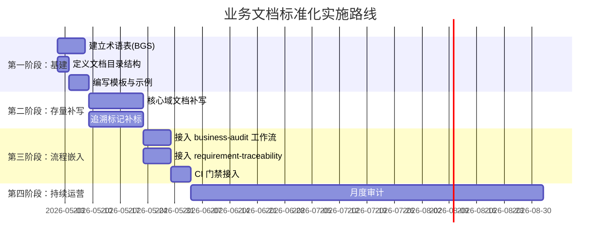

# 业务文档标准化实施手册 (Business Documentation Implementation Guide)

## 概述
本手册面向产品经理、Tech Lead 和开发团队，提供将业务文档标准化从"想法"变为"全团队日常习惯"的具体操作步骤。

## 实施路线图



## 第一阶段：基础设施搭建 (Week 1-2)

### Step 1：建立项目业务术语表
这是所有业务文档的"数据字典"。

**操作**：
1. 在项目中创建 `docs/biz/glossary.md`。
2. 召集产品、开发、测试三方（30 分钟会议），收集当前项目的核心业务术语。
3. 按 `standards/business-documentation.md` 中的 BGS 模板填写。
4. 重点消除"同义异名"（如"工单"和"订单"是否指同一个概念？）。

**产出物**：完整的业务术语表文件。

### Step 2：创建文档目录结构
```bash
mkdir -p docs/biz/{order,user,payment,inventory}
mkdir -p docs/traceability
```

### Step 3：编写第一份示范 BRS
- 选择一个**已完成的、团队熟悉的**业务需求作为示范。
- 按 BRS 模板"倒填"（从已实现的代码反向提取需求文档）。
- 完整填写 YAML front matter (包含 traceability 字段)。
- 这份示范文档将成为团队后续编写的参考范例。

## 第二阶段：存量补写 (Week 3-4)

### Step 4：按优先级补写存量需求
**优先级排序标准**：
1. 核心业务链路上的需求（如下单 → 支付 → 发货）→ 最先补写
2. 频繁被变更的模块 → 其次
3. 稳定且很少改动的辅助功能 → 最后或暂不补写

**工作分配建议**：
- 每个开发者负责补写自己最熟悉的 2-3 个模块的 BRS。
- 产品经理负责审核业务准确性。
- 预期每人每周可完成 3-5 份 BRS。

### Step 5：在代码中补标追溯标记
- 让开发者在补写 BRS 时，**同步**在对应代码文件中添加 `@bizReq` 注释。
- 在对应的测试文件中添加 `@bizReq` 和 `@acceptCriteria` 标记。
- 这是建立追溯矩阵的数据来源。

## 第三阶段：流程嵌入 (Week 5-6)

### Step 6：接入自动化工作流
- 启用 `/business-audit` 工作流，每两周运行一次，产出文档健康度报告。
- 启用 `/requirement-traceability` 工作流，每周运行一次，产出追溯覆盖率报告。
- 将报告在团队周会中同屏共享，形成公开的改善压力和正向激励。

### Step 7：CI 门禁（可选但推荐）
当团队成熟度达到一定水平后，将以下规则加入 CI 检查：
- 新增的代码文件（非工具类），如果涉及业务逻辑则必须包含 `@bizReq` 标记。
- 新增的 BRS 文档必须通过 YAML front matter 格式校验。

## 第四阶段：持续运营 (Month 2+)

### Step 8：形成日常习惯
- **新需求流程**：产品提出需求 → 先写 BRS → 开发评审 BRS → 拆分技术任务 → 编码时带上 `@bizReq` 标记。
- **变更流程**：需求变更 → 更新 BRS → 运行 `/requirement-traceability` 确认影响 → 编码修改。
- **月度审计**：定期运行 `/business-audit`，追踪文档健康度趋势。

## 常见陷阱与应对

| 陷阱 | 应对 |
|------|------|
| "写文档太花时间" | 使用 AI `documentation-gen` 技能从已有代码反向生成 BRS 初稿，人工校正修改即可 |
| "需求变了忘记更新文档" | `/business-audit` 自动检测一致性偏差并告警 |
| "不知道该写多细" | 参照示范 BRS，遵循"AI 能看懂就够"的原则——不需要像 PRD 一样巨细靡遗 |
| "存量项目太多补不完" | 只补核心链路，遵循 80/20 法则——20% 的模块承载了 80% 的业务价值 |

## 成功度量
| 指标 | 3个月目标 | 6个月目标 |
|------|---------|---------|
| 核心域 BRS 覆盖率 | ≥ 60% | ≥ 90% |
| 追溯矩阵覆盖率 | ≥ 50% | ≥ 80% |
| 文档审计评分 | ≥ 60 | ≥ 80 |
| 需求分析阶段读代码时间减少 | 30% | 60% |
