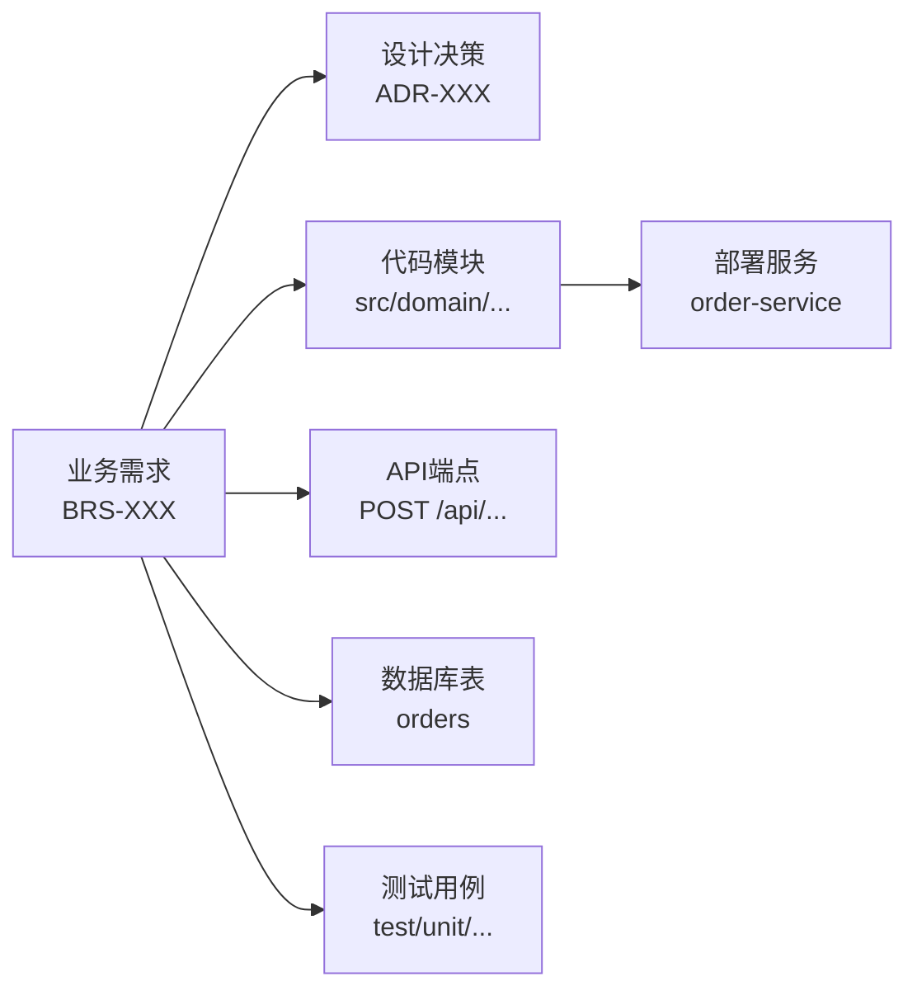

# 需求-代码-测试追溯矩阵规范 (Traceability Matrix)

## 1. 概述
追溯矩阵是连接"业务需求→代码实现→测试验证→部署产物"的双向索引。它是减少需求分析阶段反复读代码的核心基础设施。

## 2. 追溯链路



## 3. 追溯标记规范
### 3.1 代码层标记
在代码注释中引入需求追溯标记：

**JavaScript / TypeScript**:
```typescript
/**
 * 订单超时自动取消服务
 * @bizReq BRS-ORD-2026-001
 * @bizRule BR-ORD-001, BR-ORD-003
 */
class OrderTimeoutService {
  // ...
}
```

**Java**:
```java
/**
 * 订单超时自动取消服务
 * @bizReq BRS-ORD-2026-001
 * @bizRule BR-ORD-001, BR-ORD-003
 */
@Service
public class OrderTimeoutService {
    // ...
}
```

**Python**:
```python
class OrderTimeoutService:
    """订单超时自动取消服务
    
    BizReq: BRS-ORD-2026-001
    BizRule: BR-ORD-001, BR-ORD-003
    """
```

### 3.2 测试层标记
```typescript
/**
 * @bizReq BRS-ORD-2026-001
 * @acceptCriteria AC-001
 */
describe('OrderTimeoutService', () => {
  it('should auto-cancel unpaid order after 30 minutes', () => {
    // ...
  });
});
```

### 3.3 数据库 Migration 标记
```sql
-- BizReq: BRS-ORD-2026-001
-- Description: 添加订单超时状态追踪字段
ALTER TABLE orders ADD COLUMN timeout_at TIMESTAMP NULL;
```

## 4. 追溯矩阵文件格式
每个业务域维护一份追溯矩阵文件，存放在 `docs/traceability/` 目录下。

```markdown
# 订单域追溯矩阵

| 需求ID | 需求标题 | 代码模块 | API | 数据表 | 测试用例 | 状态 |
|--------|---------|---------|-----|--------|---------|------|
| BRS-ORD-2026-001 | 超时自动取消 | OrderTimeoutService | POST /orders/{id}/cancel | orders, order_logs | order-timeout.test | ✅ 已实现 |
| BRS-ORD-2026-002 | 退款流程 | RefundService | POST /orders/{id}/refund | orders, refunds | refund.test | 🚧 开发中 |
```

## 5. 追溯覆盖率指标
- **需求覆盖率** = 有代码实现标记的需求数 / 总需求数
- **测试追溯率** = 有测试关联的需求数 / 总需求数
- **孤立代码率** = 没有关联任何需求的代码模块数 / 总模块数（越低越好）

目标：需求覆盖率 ≥ 95%，测试追溯率 ≥ 90%，孤立代码率 ≤ 10%。

## 6. 自动维护
- 通过 `/requirement-traceability` 工作流自动扫描代码中的 `@bizReq` 标记并更新矩阵。
- 当发现需求有实现但缺测试、或有测试但缺需求关联时，自动产出告警。
